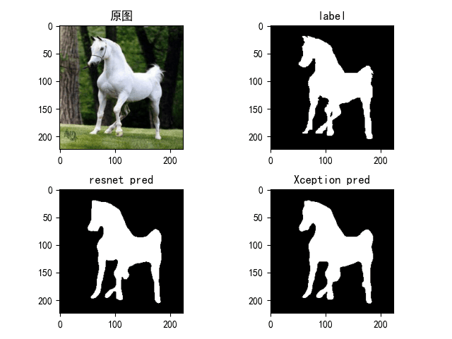

# deeplab-v3-plus
A implementation of deeplabv3 plus model by torch1.10.1.

[[1802.02611\] Encoder-Decoder with Atrous Separable Convolution for Semantic Image Segmentation (arxiv.org)](https://arxiv.org/abs/1802.02611)

# Prepare Your Data

The dataset I used is Weizmann Horse Dataset ,please download it from https://www.kaggle.com/datasets/ztaihong/weizmann-horse-database/metadata then put it into the folder weizmann_horse_db.

# Pretrained model

The Xception pretrained model is provided by Remi Cadene from https://github.com/Cadene/pretrained-models.pytorch.

Please put pretrained model into the folder pretrained.

# CKPT

This folder include two trained models:  Resnet-101 and Xception.

